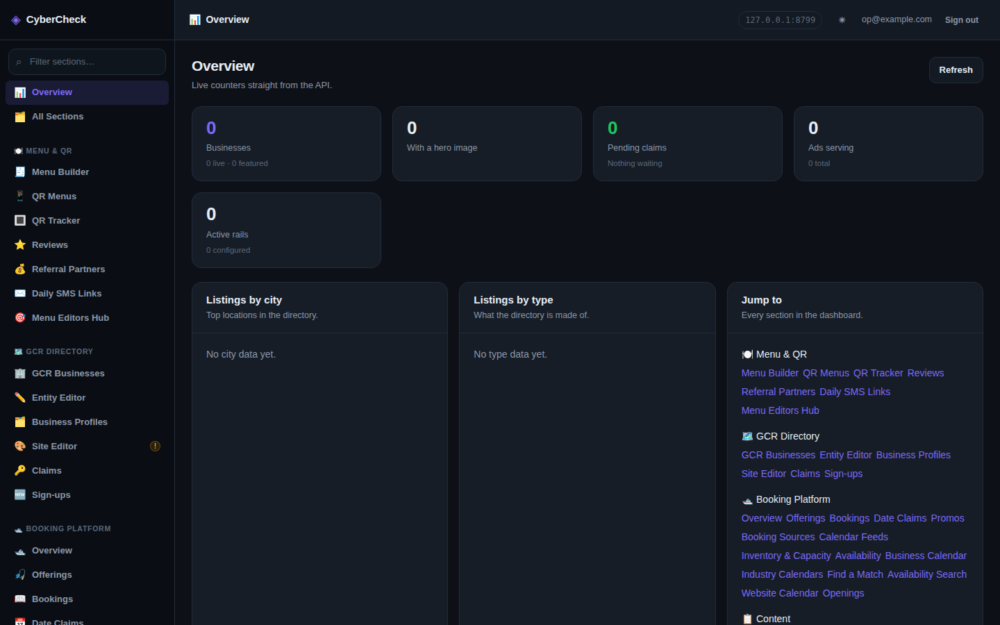
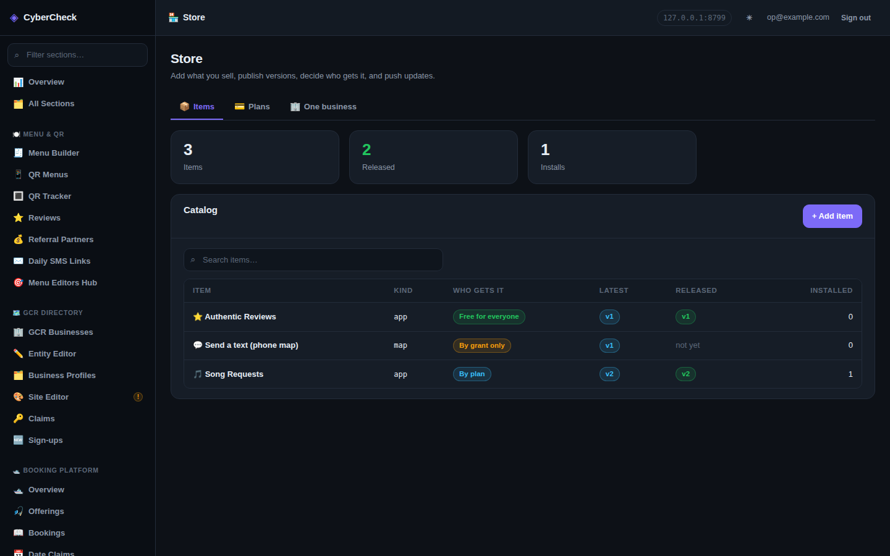
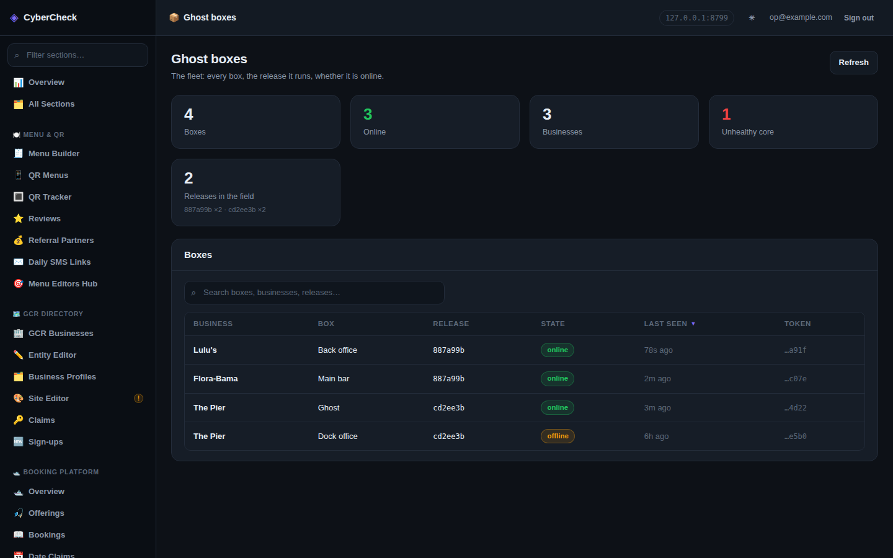
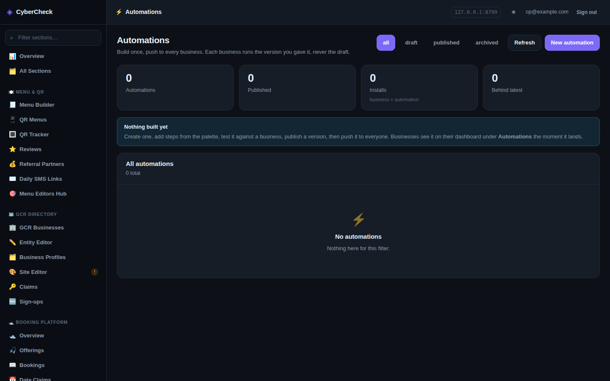
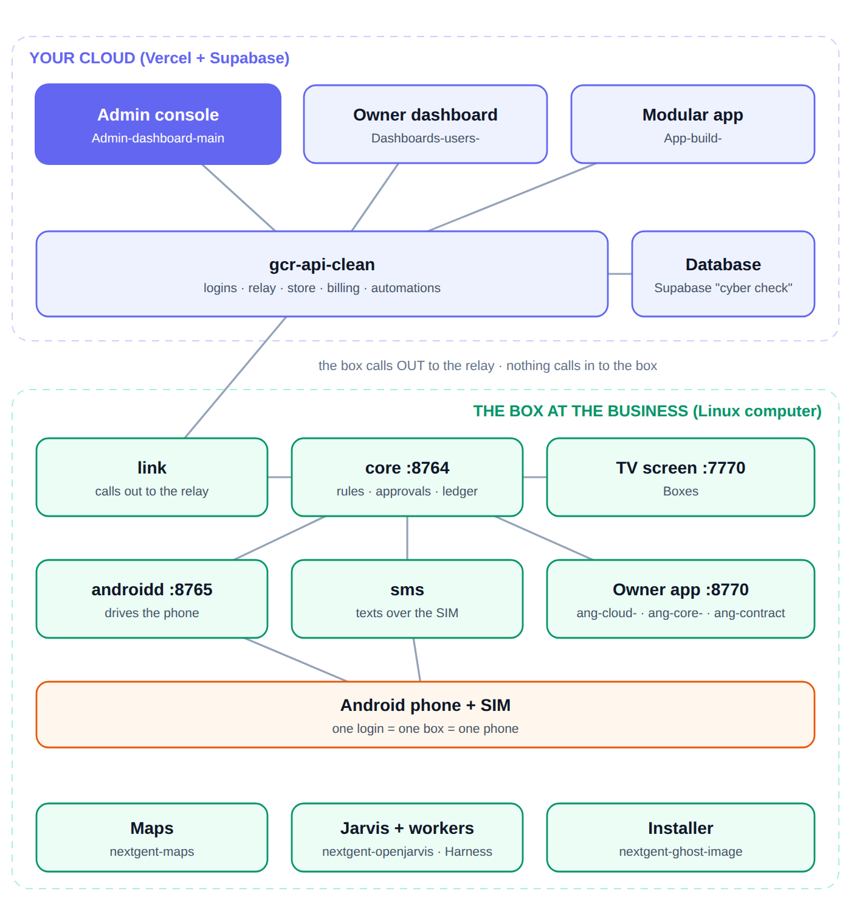

# CyberCheck Admin Dashboard

A modular React rebuild of the CyberCheck admin dashboard, wired to the
`gcr-api-clean` API.

This replaces the single 23,000-line `admin.html` in `cybercheck-login` with 90+
routed sections (95 in `src/modules/registry.js`, 87 of them in the sidebar), a
shared UI kit, and one place that knows every API path. Nothing in
`cybercheck-login` was removed — this is a new application alongside it.

**This is the operator console: you, seeing every business at once.** The screen
a business owner logs into is `Dashboards-users-`. Both talk to the same
backend, `gcr-api-clean`. Production: `admin-dashboard-main.vercel.app`.

**Where it sits in the Ghost system.** A Ghost box is a Linux computer at a
business running the blocks installed by `nextgent-ghost-image`. The cloud side
is `gcr-api-clean` (the API, and the only thing that talks to the database), this
operator console, and the business-owner dashboard `Dashboards-users-`. This
app is a browser-only React app: it holds no database key and makes every
request through `src/api/client.js` to `gcr-api-clean`. For Ghost it gives the
operator the fleet view (Ghost boxes), the App Store control panel (Store) and
the automation builder; the rest of the sections are the older directory,
booking and Trip Swipe tooling that lives in the same API.



*Overview. Captured against a test backend, so the counters read 0.*


<!-- branches:start -->
## Branches

*Read from GitHub on 2026-09-29. 12 branches.*

- **Default branch on GitHub:** `claude/cybercheck-modular-react-dashboard-7on41c`. It does **not** yet have this README or the audit fixes; those are on `claude/repo-code-analysis-y4n1k7`, which contains every commit of `claude/cybercheck-modular-react-dashboard-7on41c` and more, so it can be fast-forwarded without losing anything.
- **`claude/repo-code-analysis-y4n1k7`** is where the README audit, the screenshots and the fixes were made.
- **5 other branches hold commits that `claude/repo-code-analysis-y4n1k7` does not have.** The newest is `claude/admin-dashboard-repo-review-47q2vc` (last commit 2026-09-13, 2 commits not in the work branch). Check those before assuming the work branch is the whole story.

<details><summary>All 12 branches</summary>

| Branch | Last commit | Not in the work branch | Last commit message |
| --- | --- | --- | --- |
| `claude/repo-code-analysis-y4n1k7` (work branch) | 2026-09-29 | - | this README and the audit fixes |
| `claude/admin-dashboard-automation-builder-s0j5ht` | 2026-09-13 | 0 | Add the Automations group: list, builder, rollouts, run log |
| `claude/admin-dashboard-repo-review-47q2vc` | 2026-09-13 | 2 | Make the Live Feed section somewhere you can actually write a post |
| `claude/gcr-api-review-o45xml` | 2026-08-09 | 1 | Point the Square probe at a route that exists, drop three dead app paths |
| `claude/gcr-api-claim-docs-g4e42t` | 2026-08-05 | 3 | Read the stylesheets |
| `claude/platform-integration-launch-test-abi95i` | 2026-08-04 | 0 | Point the production build at the API instead of at itself |
| `main` | 2026-08-04 | 0 | Trigger production deployment from current main |
| `claude/new-session-1e1dj0` | 2026-08-04 | 1 | Make the App Store search find things |
| `claude/tourist-dashboard-layout-hi2yxu` | 2026-08-04 | 1 | Move Connections out of Booking and into App Store |
| `claude/dashboard-inventory-purposes-m5wtba` | 2026-08-04 | 0 | Show the invite link so it can be sent by hand |
| `build/nextgent-map-control` | 2026-08-03 | 0 | Add Text the Dashboard |
| `claude/cybercheck-modular-react-dashboard-7on41c` (default) | 2026-08-03 | 0 | Add Text the Dashboard |

</details>

<!-- branches:end -->

## Store and Ghost boxes

Two sections were added for the Ghost product (Store sits in the App Store
group, Ghost boxes in the Platform group; both are backed by routes in
`gcr-api-clean`):

**Store** (`/store`, `src/modules/store/`) is the App Store control panel: add an
item (app, module, map, parser, automation, box release, integration), publish
versions, decide who gets it (free, in a plan, or granted to one business), and
push it (release, offer, install, or force; offer, install and force show a
preview of who would receive it first).



**Ghost boxes** (`/platform/ghost`) is the fleet: every box at every business,
the release it runs, and whether it is online. Read-only.



*Both captures use sample items and sample boxes on a test backend.*

**Automations** (`/automations`) builds a trigger and steps once, publishes a
version and pushes it to businesses.



*Empty state, as it looks before the first automation is built.*



## Running it

```bash
npm install
cp .env.example .env      # set VITE_API_BASE_URL
npm run dev               # http://localhost:5173
npm run build             # production build to dist/
npm run preview           # serve the build
npm run lint
```

Sign in with an admin account from the `admin_users` table —
`POST /api/admin/login` returns the JWT the dashboard stores.

## Nothing is hardcoded

That was the point of the rebuild, so it is worth being specific about what it
means here.

**No hostnames in source.** Every environment value resolves through
`src/config/env.js`, in this order: `window.__ADMIN_CONFIG__` → `import.meta.env`
→ a documented fallback (the one hostname in code is the default API base,
`DEFAULT_API_BASE` in that file). A deployment can be repointed at a different API by
defining `window.__ADMIN_CONFIG__` before the app loads, with no rebuild:
`index.html` initialises it to an empty object, and a `config.js` would need a
`<script>` tag added there (none is present today). Platform → Settings shows
every resolved value and the variable that set it.

**No API paths in components.** All 350+ paths (357 counted by
`npm run audit:endpoints`) live in `src/api/endpoints.js` as
functions of their parameters. A route change in `gcr-api-clean` is a one-line
edit there, not a search across sixty files. The only literal `/api/...` paths
outside that file are the health-probe URLs in
`src/modules/platform/Integrations.jsx`.

**No hand-written navigation or routes.** `src/modules/registry.js` lists every
section once; the sidebar, the router, and the Overview page's index are all
generated from it. Adding a section is a file plus one entry.

**No hand-written forms or tables.** Fields and columns are descriptors.
The Entity Editor's Info tab is over 50 fields defined as data in
`src/modules/directory/entitySchema.js`, mirroring the real `entity` table;
`SchemaForm` renders, validates, and submits them. `DataTable` works the same
way for columns, with search, sort, and pagination built in.

**No hardcoded businesses, slugs, or IDs.** Every screen that operates on a
business gets it from `EntityPicker`, which loads the directory once and shares
the selection across sections and across reloads.

**No repeated CRUD plumbing.** `createResource` + `useResource` + `CrudSection`
turn "list, create, edit, delete" into a descriptor. The 20 section modules that
use them are short and behave identically; the larger sections (booking,
automations, the Entity Editor) are hand-written.

**Almost no colour literals in components.** Colours route through the design
tokens in `src/styles/theme.css`, which is also what makes the light/dark toggle
a single attribute flip. The exceptions are the embeddable-calendar preview in
`src/modules/booking/WebsiteCalendar.jsx` and a few values in
`src/components/AppStoreView.css` and `src/modules/appstore/Connections.css`.

## Layout

```
src/
├── config/env.js            runtime configuration — the only place env is read
├── api/
│   ├── endpoints.js         every API path, once
│   ├── client.js            fetch wrapper: auth, JSON, timeouts, typed errors
│   ├── createResource.js    generic CRUD factory
│   └── resources.js         resource definitions per domain
├── auth/                    token store, AuthContext, login screen
├── ui/                      DataTable, SchemaForm, Modal, Tabs, Toast, CrudSection…
├── hooks/                   useAsync, useAction, useResource, usePersistentState
├── components/              EntityPicker, ConfigCard, SectionedItemsEditor
├── lib/                     field/column helpers, content schemas, CSV parser
├── shell/                   sidebar, top bar, routing, error boundary, theme
└── modules/
    ├── registry.js          the one list of sections
    ├── home/ menu/ directory/ booking/ content/ ai/ engagement/ tripswipe/
    │   automations/ appstore/ store/ platform/
    └── directory/tabs/      the Entity Editor's eleven tabs, themselves a registry
```

## Sections

87 sidebar entries in eleven groups (`NAV_GROUPS` in `registry.js`). Eight
further routes are hidden from the sidebar (detail pages such as the automation
builder, and the two legacy App Store pages):

- **Overview** — Overview, All Sections
- **Menu & QR** — Menu Builder, QR Menus, QR Tracker, Reviews, Referral
  Partners, Daily SMS Links, Menu Editors Hub
- **GCR Directory** — GCR Businesses, Entity Editor, Business Profiles, Site
  Editor, Claims, Sign-ups
- **Booking Platform** (backed by `/api/admin/platform`) — Overview, Offerings,
  Bookings, Date Claims, Promos, Booking Sources, Calendar Feeds, Inventory &
  Capacity, Availability, Business Calendar, Industry Calendars, Find a Match,
  Availability Search, Website Calendar, Openings
- **Content** — Events, Artists, Song Requests & Tips, Specials, Ad Network,
  Page Rails, AI Config, Coupons, Tags & SEO, Bulk Upload, Bulk Events
- **AI Tools** — AI Chat, AI Data Organizer, AI Index / RAG, AI Settings
- **Engagement** — Visitor Behaviour, Analytics, Reviews, Customers, SMS /
  Messaging, Social & Connections
- **Trip Swipe** — Overview, Businesses, Tourists, Swipe Analytics, AI Feedback,
  Concierge Test, Swipe Questions, Sponsored, Tonight Cards, Points & Rewards,
  Text Sign-Up QR Codes, Auth Settings, Button Config, SMS Settings, SMS Blasts,
  Business Leads, Guest Photos
- **Automations** — Automations, Rollouts, Run log (the builder is a hidden
  route opened from Automations). Build a trigger + steps, test against one
  business, publish a version, push it to every business's dashboard. See
  `src/modules/automations/`.
- **App Store** — **Store**, Connections catalog (the Composio catalogue),
  Connections. App Manager and Business Apps are the older pages: hidden but
  still routable, replaced by **Store**.
- **Platform** — Text the Dashboard, Intake, **Ghost boxes**, Businesses, Leads,
  Bookings, Sales Pages, AR Hunts, Integrations, People, Users, API Keys,
  Settings

The Entity Editor carries eleven tabs: Info, Hours, Photos, Tags, Features,
Content (menu / drinks / happy hour / events / specials), Sections, Details
(per-entity collections), Pages, Listing Data, and Calendar.

## Honest failure

Read `docs/ENDPOINT-STATUS.md` before assuming a screen is broken.

When the rebuild was written, 34 of the 117 API paths the legacy dashboard calls
had no matching route in `gcr-api-clean` (that count is recorded in
`docs/ENDPOINT-STATUS.md` and was not re-derived). Measured today against the
checked-out `gcr-api-clean`, `npm run audit:endpoints` finds 357 endpoints
reachable from this dashboard, 346 resolving to a mounted route and 11 declared
as known missing. Where a working route existed, this app uses it. Where none
does, the screen is wired to the same path the old dashboard used and **says on
screen** that the route is not deployed, naming the path — rather than showing a
form that appears to save and does not. Nine sections are marked `partial` in
`registry.js`; they carry an amber `!` in the sidebar and are listed in
Platform → Settings.

The API client distinguishes a missing endpoint (404/405) from a network failure
from a server error, because those need different fixes. `PATCH` responses that
return `207 { success: false }` are treated as failures, not successes — a 207
passes `response.ok` and would otherwise look like a clean save.

## Verification

`npm run build` passes and `npm run lint` reports no errors (five unused-variable
or unused-import warnings). All 61 routes were walked in headless Chromium
against a stubbed API: every section mounted and rendered with zero page errors
and zero console errors. That walk predates the current registry, which defines
95 routes.

Live API calls could not be exercised from the build environment — outbound
network access is sandboxed — so request/response shapes were derived from
`gcr-api-clean`'s route handlers and `schema.sql` rather than from live traffic.
Worth a pass against the real API before relying on the less-trafficked screens.
